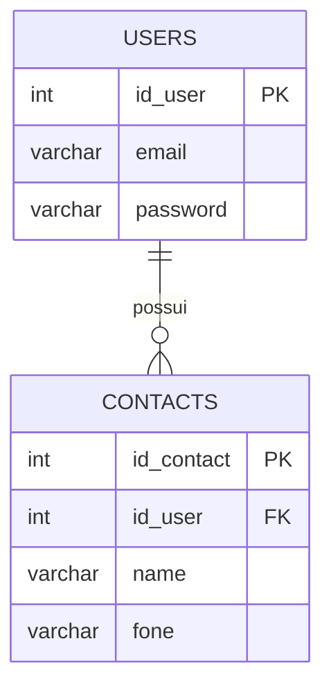
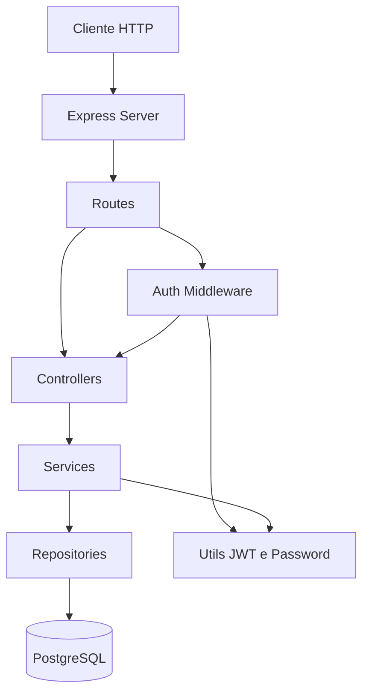
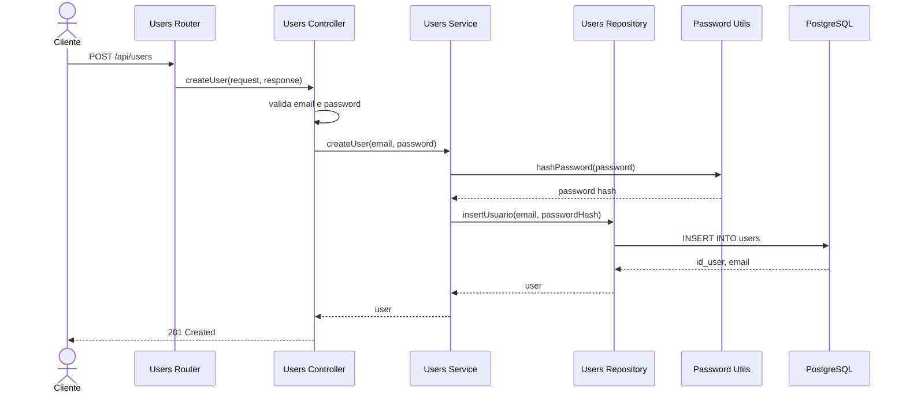
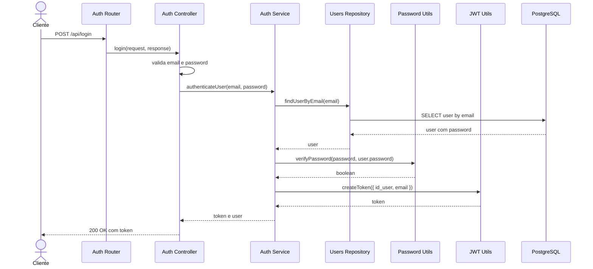
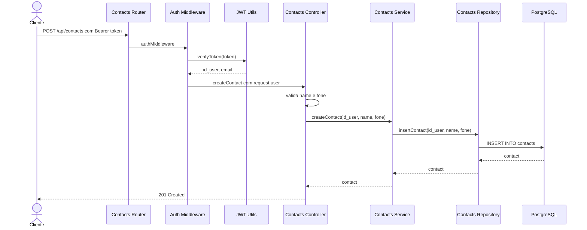
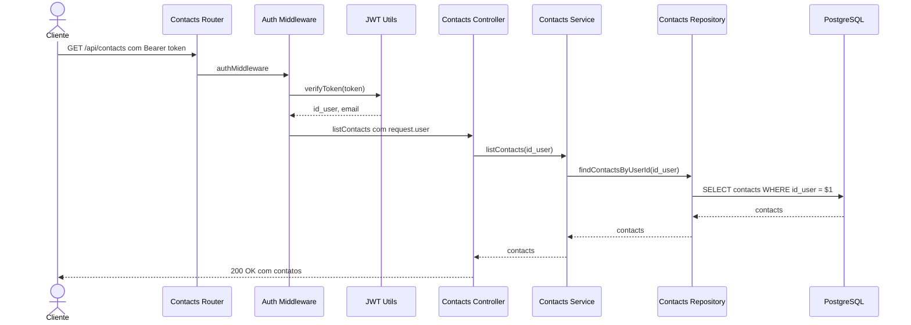

# Server - API de usuários e contatos

API em Node.js, Express, TypeScript e PostgreSQL para cadastro de usuários, login com JWT e gerenciamento de contatos do usuário autenticado.

## Requisitos

- Node.js
- npm
- PostgreSQL

## Configuração do ambiente

Crie o arquivo `.env` na raiz do projeto:

```env
PORT=3001

POSTGRES_HOST=localhost
POSTGRES_USER=postgres
POSTGRES_PASSWORD=123
POSTGRES_DB=bdaula
POSTGRES_PORT=5432

JWT_SECRET=@codigo_secreto@
DEFAULT_EXPIRES_IN_SECONDS=600
```

Instale as dependências:

```bash
npm install
```

## Criar o banco de dados e tabelas

Crie o banco no PostgreSQL:

```bash
createdb -h localhost -p 5432 -U postgres bdaula
```

Depois execute os scripts SQL do projeto:

```bash
npm run db:init
```

Esse comando compila o TypeScript e executa:

- `src/infra/init/schema-sql.sql`: cria as tabelas `users` e `contacts`
- `src/infra/init/seed-data.sql`: limpa as tabelas e insere dados iniciais

## Organização do código

- `routes`: definem os endpoints e os middlewares de cada rota.
- `controllers`: tratam `request`, `response`, status HTTP e validações de entrada.
- `services`: concentram regras de negócio e orquestram repositories e utils.
- `repositories`: executam consultas SQL e acessam o PostgreSQL.
- `middlewares`: executam passos comuns antes dos controllers, como autenticação.
- `utils`: agrupam funções auxiliares de JWT e senha.

## Subir o projeto

Execute:

```bash
npm run dev
```

Com o `.env` acima, a API ficará disponível em:

```text
http://localhost:3001
```

## Por que esta aplicação é RESTful?

Esta aplicação pode ser considerada uma API RESTful porque expõe recursos do sistema por meio de URLs e usa os métodos HTTP para indicar a operação que será realizada. Os principais recursos da aplicação são `users` e `contacts`, acessados por rotas como `/api/users` e `/api/contacts`.

Em vez de chamar funções diretamente, o cliente interage com a API enviando requisições HTTP. Por exemplo, `POST /api/users` cria um usuário, `GET /api/contacts` lista os contatos do usuário autenticado, `POST /api/contacts` cria um novo contato, `PATCH /api/contacts/:id_contact/name` atualiza parte de um contato e `DELETE /api/contacts/:id_contact` remove um contato.

A aplicação também retorna respostas em JSON e utiliza códigos de status HTTP para representar o resultado das operações, como `201 Created` ao criar registros, `400 Bad Request` quando faltam dados obrigatórios e `404 Not Found` quando um recurso não é encontrado.

Outro ponto importante é que a API trabalha de forma stateless. Cada requisição para rotas protegidas precisa enviar o token JWT no cabeçalho `Authorization`, permitindo que o servidor identifique o usuário autenticado sem depender de uma sessão armazenada entre as requisições.

Portanto, esta aplicação segue os principais princípios REST ao organizar suas funcionalidades em recursos, usar métodos HTTP adequados, retornar dados padronizados em JSON, aplicar status HTTP e manter a comunicação independente entre cliente e servidor.

## Rotas de teste

### Criar usuário

```bash
curl -X POST http://localhost:3001/api/users \
  -H "Content-Type: application/json" \
  -d '{"email":"novo@email.com","password":"123456"}'
```

Resposta esperada:

```json
{
  "id_user": 4,
  "email": "novo@email.com"
}
```

### Login

```bash
curl -X POST http://localhost:3001/api/login \
  -H "Content-Type: application/json" \
  -d '{"email":"usuario1@email.com","password":"123456"}'
```

Resposta esperada:

```json
{
  "token": "JWT_GERADO",
  "user": {
    "id_user": 1,
    "email": "usuario1@email.com"
  }
}
```

### Atualizar email do usuário logado

Substitua `JWT_GERADO` pelo token retornado no login:

```bash
curl -X PATCH http://localhost:3001/api/users/email \
  -H "Content-Type: application/json" \
  -H "Authorization: Bearer JWT_GERADO" \
  -d '{"email":"usuario1-novo@email.com"}'
```

Resposta esperada:

```json
{
  "id_user": 1,
  "email": "usuario1-novo@email.com"
}
```

### Atualizar senha do usuário logado

```bash
curl -X PATCH http://localhost:3001/api/users/password \
  -H "Content-Type: application/json" \
  -H "Authorization: Bearer JWT_GERADO" \
  -d '{"password":"nova-senha"}'
```

Resposta esperada:

```json
{
  "message": "Senha atualizada com sucesso."
}
```

### Criar contato do usuário logado

Substitua `JWT_GERADO` pelo token retornado no login:

```bash
curl -X POST http://localhost:3001/api/contacts \
  -H "Content-Type: application/json" \
  -H "Authorization: Bearer JWT_GERADO" \
  -d '{"name":"Maria Silva","fone":"(12)99999-0000"}'
```

Resposta esperada:

```json
{
  "id_contact": 91,
  "id_user": 1,
  "name": "Maria Silva",
  "fone": "(12)99999-0000"
}
```

### Listar contatos do usuário logado

```bash
curl http://localhost:3001/api/contacts \
  -H "Authorization: Bearer JWT_GERADO"
```

Resposta esperada:

```json
[
  {
    "id_contact": 1,
    "id_user": 1,
    "name": "Contato 1 - Usuario 1",
    "fone": "(12) 900010001"
  }
]
```

### Atualizar nome do contato

```bash
curl -X PATCH http://localhost:3001/api/contacts/1/name \
  -H "Content-Type: application/json" \
  -H "Authorization: Bearer JWT_GERADO" \
  -d '{"name":"Maria Souza"}'
```

Resposta esperada:

```json
{
  "id_contact": 1,
  "id_user": 1,
  "name": "Maria Souza",
  "fone": "(12) 900010001"
}
```

### Atualizar telefone do contato

```bash
curl -X PATCH http://localhost:3001/api/contacts/1/fone \
  -H "Content-Type: application/json" \
  -H "Authorization: Bearer JWT_GERADO" \
  -d '{"fone":"(12)98888-7777"}'
```

Resposta esperada:

```json
{
  "id_contact": 1,
  "id_user": 1,
  "name": "Maria Souza",
  "fone": "(12)98888-7777"
}
```

### Excluir contato

```bash
curl -X DELETE http://localhost:3001/api/contacts/1 \
  -H "Authorization: Bearer JWT_GERADO"
```

Resposta esperada:

```json
{
  "message": "Contato excluído com sucesso."
}
```

## Diagrama do BD



## Diagrama de componentes



## Diagramas de sequência

### POST /api/users



### POST /api/login



### POST /api/contacts



### GET /api/contacts


