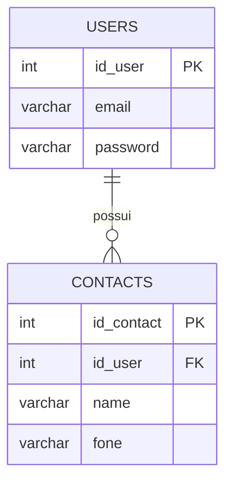
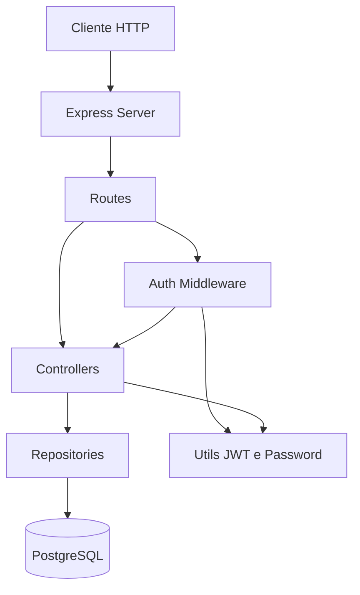
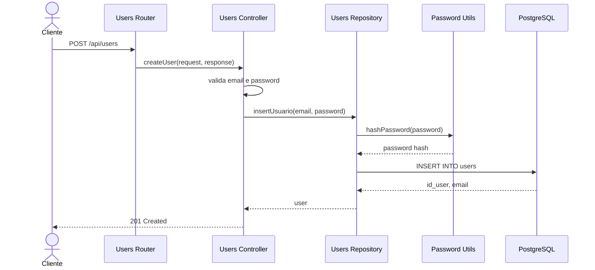
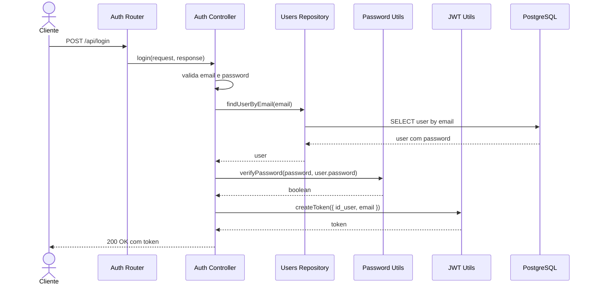
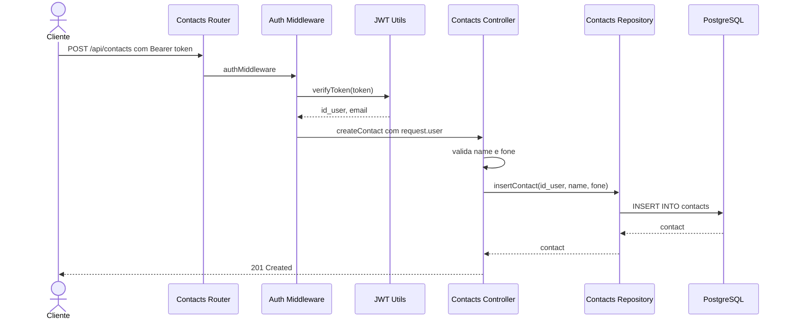
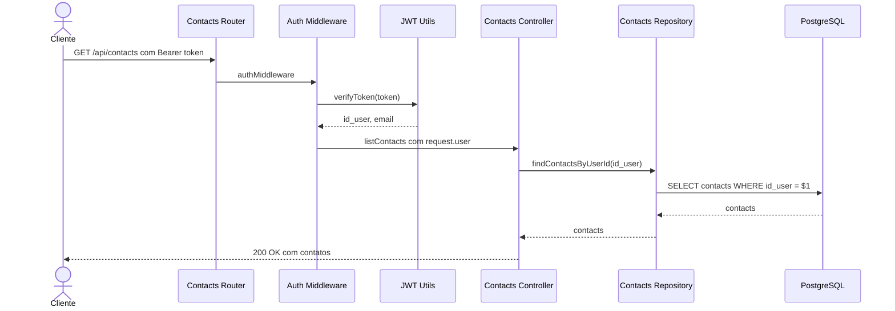

# Server - API de usuários e contatos

API em Node.js, Express, TypeScript e PostgreSQL para cadastro de usuários, login com JWT e gerenciamento de contatos do usuário autenticado.

## Requisitos

- Node.js
- npm
- PostgreSQL

## Configuração do ambiente

Crie o arquivo `.env` na raiz do projeto:

```env
PORT=3001

POSTGRES_HOST=localhost
POSTGRES_USER=postgres
POSTGRES_PASSWORD=123
POSTGRES_DB=bdaula
POSTGRES_PORT=5432

JWT_SECRET=@codigo_secreto@
DEFAULT_EXPIRES_IN_SECONDS=600
```

Instale as dependências:

```bash
npm install
```

## Criar o banco de dados e tabelas

Crie o banco no PostgreSQL:

```bash
createdb -h localhost -p 5432 -U postgres bdaula
```

Depois execute os scripts SQL do projeto:

```bash
npm run db:init
```

Esse comando compila o TypeScript e executa:

- `src/infra/init/schema-sql.sql`: cria as tabelas `users` e `contacts`
- `src/infra/init/seed-data.sql`: limpa as tabelas e insere dados iniciais

## Subir o projeto

Execute:

```bash
npm run dev
```

Com o `.env` acima, a API ficará disponível em:

```text
http://localhost:3001
```

## Rotas de teste

### Criar usuário

```bash
curl -X POST http://localhost:3001/api/users \
  -H "Content-Type: application/json" \
  -d '{"email":"novo@email.com","password":"123456"}'
```

Resposta esperada:

```json
{
  "id_user": 4,
  "email": "novo@email.com"
}
```

### Login

```bash
curl -X POST http://localhost:3001/api/login \
  -H "Content-Type: application/json" \
  -d '{"email":"usuario1@email.com","password":"123456"}'
```

Resposta esperada:

```json
{
  "token": "JWT_GERADO",
  "user": {
    "id_user": 1,
    "email": "usuario1@email.com"
  }
}
```

### Atualizar email do usuário logado

Substitua `JWT_GERADO` pelo token retornado no login:

```bash
curl -X PATCH http://localhost:3001/api/users/email \
  -H "Content-Type: application/json" \
  -H "Authorization: Bearer JWT_GERADO" \
  -d '{"email":"usuario1-novo@email.com"}'
```

Resposta esperada:

```json
{
  "id_user": 1,
  "email": "usuario1-novo@email.com"
}
```

### Atualizar senha do usuário logado

```bash
curl -X PATCH http://localhost:3001/api/users/password \
  -H "Content-Type: application/json" \
  -H "Authorization: Bearer JWT_GERADO" \
  -d '{"password":"nova-senha"}'
```

Resposta esperada:

```json
{
  "message": "Senha atualizada com sucesso."
}
```

### Criar contato do usuário logado

Substitua `JWT_GERADO` pelo token retornado no login:

```bash
curl -X POST http://localhost:3001/api/contacts \
  -H "Content-Type: application/json" \
  -H "Authorization: Bearer JWT_GERADO" \
  -d '{"name":"Maria Silva","fone":"(12)99999-0000"}'
```

Resposta esperada:

```json
{
  "id_contact": 91,
  "id_user": 1,
  "name": "Maria Silva",
  "fone": "(12)99999-0000"
}
```

### Listar contatos do usuário logado

```bash
curl http://localhost:3001/api/contacts \
  -H "Authorization: Bearer JWT_GERADO"
```

Resposta esperada:

```json
[
  {
    "id_contact": 1,
    "id_user": 1,
    "name": "Contato 1 - Usuario 1",
    "fone": "(12) 900010001"
  }
]
```

## Diagrama do BD



## Diagrama de componentes



## Diagramas de sequência

### POST /api/users



### POST /api/login



### POST /api/contacts



### GET /api/contacts


